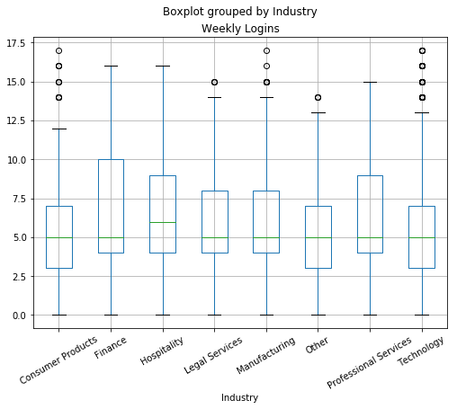
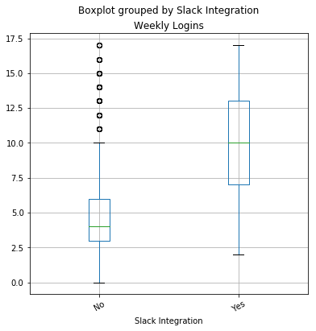
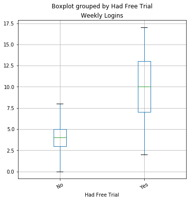

I need to answer the question: What categories or groups here had high engagement (weekly logins) levels? Using information from a CSV.

### Short answer

Slack Integration and Had Free Trail categories marked Yes had high engagement levels.

### Approach

I opened the csv in an Excel file to quickly visualize all the data and type of variables. I made a dynamic table and ordered the data by Weekly Logins to see if I could get a clue on a category or group related to the engagement. Almost all fields (columns) were categorycal data, with the exception of Weekly Logins and Sales Closes to Touch.

Some of them where just Yes or No fields, but other had a varying number of categories.

I started thinking that maybe the Yes or No fields could be made binomial and then just check correlation with Weekly Logins, but I was still missing a solution for the rest of the fields.

I did some research to find how to relate a continuous variable with categorical variables, and I found that a lot of python libraries had algorithms for that, nameley statistic anlysis like ANOVA.

So I decided to explore these libraries and make the analysis with python.

### Analysis


```python
import pandas as pd
import numpy as np
import copy
%matplotlib inline
```


```python
df = pd.read_csv('C://Users/Luis/Downloads/weekly_logins.csv')
```

First, I checked how the data looks now that it is imported


```python
df.head()
```


<div>
<style scoped>
    .dataframe tbody tr th:only-of-type {
        vertical-align: middle;
    }

    .dataframe tbody tr th {
        vertical-align: top;
    }

    .dataframe thead th {
        text-align: right;
    }
</style>
<table border="1" class="dataframe">
  <thead>
    <tr style="text-align: right;">
      <th></th>
      <th>User Name</th>
      <th>Slack Integration</th>
      <th>Most Used Page</th>
      <th>Had Free Trial</th>
      <th>User MRR</th>
      <th>Weekly Logins</th>
      <th>Company Name</th>
      <th>Industry</th>
      <th>Company Size</th>
      <th>Territory</th>
      <th>Sales Call in Trial</th>
      <th>Zendesk Integration</th>
      <th>Salesforce Integration</th>
      <th>Gmail Integration</th>
      <th>Most common referrer</th>
      <th>Most common IP</th>
      <th>Sales Touches to Close</th>
      <th>Used Admin Panel</th>
      <th>Has Issued Support Request</th>
    </tr>
  </thead>
  <tbody>
    <tr>
      <th>0</th>
      <td>Nilsa Harmon</td>
      <td>No</td>
      <td>/home</td>
      <td>No</td>
      <td>39</td>
      <td>2</td>
      <td>HP</td>
      <td>Technology</td>
      <td>&gt;$10B</td>
      <td>West</td>
      <td>No</td>
      <td>Yes</td>
      <td>No</td>
      <td>Yes</td>
      <td>hotels.com</td>
      <td>165.227.215.62</td>
      <td>5</td>
      <td>No</td>
      <td>No</td>
    </tr>
    <tr>
      <th>1</th>
      <td>Joni Catano</td>
      <td>No</td>
      <td>/tool/storyboard</td>
      <td>No</td>
      <td>39</td>
      <td>6</td>
      <td>HP</td>
      <td>Technology</td>
      <td>&gt;$10B</td>
      <td>West</td>
      <td>No</td>
      <td>Yes</td>
      <td>Yes</td>
      <td>No</td>
      <td>hotels.com</td>
      <td>159.203.166.41</td>
      <td>16</td>
      <td>No</td>
      <td>Yes</td>
    </tr>
    <tr>
      <th>2</th>
      <td>Emmett Jeffries</td>
      <td>Yes</td>
      <td>/tool/search</td>
      <td>Yes</td>
      <td>169</td>
      <td>3</td>
      <td>HP</td>
      <td>Technology</td>
      <td>&gt;$10B</td>
      <td>West</td>
      <td>Yes</td>
      <td>No</td>
      <td>Yes</td>
      <td>No</td>
      <td>hotels.com</td>
      <td>159.203.166.41</td>
      <td>4</td>
      <td>No</td>
      <td>Yes</td>
    </tr>
    <tr>
      <th>3</th>
      <td>Dian Boisse</td>
      <td>No</td>
      <td>/tool/storyboard</td>
      <td>No</td>
      <td>39</td>
      <td>2</td>
      <td>HP</td>
      <td>Technology</td>
      <td>&gt;$10B</td>
      <td>West</td>
      <td>No</td>
      <td>Yes</td>
      <td>No</td>
      <td>No</td>
      <td>zoom.com</td>
      <td>162.243.108.129</td>
      <td>15</td>
      <td>No</td>
      <td>Yes</td>
    </tr>
    <tr>
      <th>4</th>
      <td>Barbara Herrera</td>
      <td>No</td>
      <td>/tool/storyboard</td>
      <td>No</td>
      <td>1299</td>
      <td>7</td>
      <td>HP</td>
      <td>Technology</td>
      <td>&gt;$10B</td>
      <td>West</td>
      <td>No</td>
      <td>No</td>
      <td>Yes</td>
      <td>No</td>
      <td>/mail.google.com</td>
      <td>159.203.166.41</td>
      <td>5</td>
      <td>No</td>
      <td>Yes</td>
    </tr>
  </tbody>
</table>
</div>


```python
df.describe()
```


<div>
<style scoped>
    .dataframe tbody tr th:only-of-type {
        vertical-align: middle;
    }

    .dataframe tbody tr th {
        vertical-align: top;
    }

    .dataframe thead th {
        text-align: right;
    }
</style>
<table border="1" class="dataframe">
  <thead>
    <tr style="text-align: right;">
      <th></th>
      <th>User MRR</th>
      <th>Weekly Logins</th>
      <th>Sales Touches to Close</th>
    </tr>
  </thead>
  <tbody>
    <tr>
      <th>count</th>
      <td>1718.000000</td>
      <td>1718.000000</td>
      <td>1718.000000</td>
    </tr>
    <tr>
      <th>mean</th>
      <td>212.364377</td>
      <td>6.065774</td>
      <td>9.929569</td>
    </tr>
    <tr>
      <th>std</th>
      <td>367.568435</td>
      <td>3.847528</td>
      <td>3.705564</td>
    </tr>
    <tr>
      <th>min</th>
      <td>39.000000</td>
      <td>0.000000</td>
      <td>4.000000</td>
    </tr>
    <tr>
      <th>25%</th>
      <td>39.000000</td>
      <td>3.000000</td>
      <td>7.000000</td>
    </tr>
    <tr>
      <th>50%</th>
      <td>39.000000</td>
      <td>5.000000</td>
      <td>10.000000</td>
    </tr>
    <tr>
      <th>75%</th>
      <td>169.000000</td>
      <td>8.000000</td>
      <td>13.000000</td>
    </tr>
    <tr>
      <th>max</th>
      <td>1299.000000</td>
      <td>17.000000</td>
      <td>16.000000</td>
    </tr>
  </tbody>
</table>
</div>


The most important info here is the mean of Weekly Logins at 6.

I only saw three colums and I remeber having 19 so this result raised some concerns regarding types of variables and how python read the csv so I checked that. Probably I had to do some work with the rest of the colums to do a good analysis.


```python
df.info()
```

    <class 'pandas.core.frame.DataFrame'>
    RangeIndex: 1718 entries, 0 to 1717
    Data columns (total 19 columns):
    User Name                     1718 non-null object
    Slack Integration             1718 non-null object
    Most Used Page                1718 non-null object
    Had Free Trial                1718 non-null object
    User MRR                      1718 non-null int64
    Weekly Logins                 1718 non-null int64
    Company Name                  1718 non-null object
    Industry                      1718 non-null object
    Company Size                  1718 non-null object
    Territory                     1718 non-null object
    Sales Call in Trial           1718 non-null object
    Zendesk Integration           1718 non-null object
    Salesforce Integration        1718 non-null object
    Gmail Integration             1718 non-null object
    Most common referrer          1718 non-null object
    Most common IP                1718 non-null object
    Sales Touches to Close        1718 non-null int64
    Used Admin Panel              1718 non-null object
    Has Issued Support Request    1718 non-null object
    dtypes: int64(3), object(16)
    memory usage: 255.1+ KB
    

I imagined some ways to visualize categorical data against a continuous varibale and thought that maybe a boxplot diagram would be appropiate.

A boxplot diagram shows how certain categories are distributed along a continuous variable, so I expect, with this data visualization, to find some categories which are distributed towards more or less engagement, so I can affirm some sort of correlation.

I tried to see if  using pandas I could plot one of these categories against Weekly Logins in a box plot, without changing the data types. I chose Industry first becuase I had a hunch that this field may be related to engagement. I wanted to disproof this hunch.


```python
df.boxplot('Weekly Logins','Industry',rot = 30,figsize=(8,6));
```

    C:\Users\Luis\Anaconda3\lib\site-packages\numpy\core\_asarray.py:83: VisibleDeprecationWarning: Creating an ndarray from ragged nested sequences (which is a list-or-tuple of lists-or-tuples-or ndarrays with different lengths or shapes) is deprecated. If you meant to do this, you must specify 'dtype=object' when creating the ndarray
      return array(a, dtype, copy=False, order=order)
    





At this point I see that I don't need tho change the data types. It's worth noting that all eight options spawn to zero weekly logins, so probably there is no relationship between Industry and Engagement. From the diagram, I observe that maybe people in Finance and Hospitality industries login to the site more often than, but I cannot really be sure that there is a strong correlation. 

I would like to get a specific numerical result that its easy to compare once I check each column, so I made a little research and find researchpy library.


```python
import researchpy as rp
```


```python
rp.summary_cont(df['Weekly Logins'].groupby(df['Industry'])) 
```

    
    
    


<div>
<style scoped>
    .dataframe tbody tr th:only-of-type {
        vertical-align: middle;
    }

    .dataframe tbody tr th {
        vertical-align: top;
    }

    .dataframe thead th {
        text-align: right;
    }
</style>
<table border="1" class="dataframe">
  <thead>
    <tr style="text-align: right;">
      <th></th>
      <th>N</th>
      <th>Mean</th>
      <th>SD</th>
      <th>SE</th>
      <th>95% Conf.</th>
      <th>Interval</th>
    </tr>
    <tr>
      <th>Industry</th>
      <th></th>
      <th></th>
      <th></th>
      <th></th>
      <th></th>
      <th></th>
    </tr>
  </thead>
  <tbody>
    <tr>
      <th>Consumer Products</th>
      <td>99</td>
      <td>6.1414</td>
      <td>4.0305</td>
      <td>0.4051</td>
      <td>5.3375</td>
      <td>6.9453</td>
    </tr>
    <tr>
      <th>Finance</th>
      <td>137</td>
      <td>6.5328</td>
      <td>3.9090</td>
      <td>0.3340</td>
      <td>5.8724</td>
      <td>7.1933</td>
    </tr>
    <tr>
      <th>Hospitality</th>
      <td>147</td>
      <td>6.5170</td>
      <td>3.8506</td>
      <td>0.3176</td>
      <td>5.8893</td>
      <td>7.1447</td>
    </tr>
    <tr>
      <th>Legal Services</th>
      <td>98</td>
      <td>6.2755</td>
      <td>3.7466</td>
      <td>0.3785</td>
      <td>5.5244</td>
      <td>7.0266</td>
    </tr>
    <tr>
      <th>Manufacturing</th>
      <td>233</td>
      <td>5.9142</td>
      <td>3.8046</td>
      <td>0.2493</td>
      <td>5.4231</td>
      <td>6.4052</td>
    </tr>
    <tr>
      <th>Other</th>
      <td>67</td>
      <td>5.6716</td>
      <td>3.5351</td>
      <td>0.4319</td>
      <td>4.8094</td>
      <td>6.5339</td>
    </tr>
    <tr>
      <th>Professional Services</th>
      <td>42</td>
      <td>6.5238</td>
      <td>3.6642</td>
      <td>0.5654</td>
      <td>5.3820</td>
      <td>7.6656</td>
    </tr>
    <tr>
      <th>Technology</th>
      <td>895</td>
      <td>5.9363</td>
      <td>3.8691</td>
      <td>0.1293</td>
      <td>5.6825</td>
      <td>6.1901</td>
    </tr>
  </tbody>
</table>
</div>


I realize that the mean and the 95% confidence interval strongly validate my findings about Finance and Hospitality being the most related to Logins, along with Professional Services, that I didn't notice at first. With this proof I decide to use the mean and the confidence interval to compare options in each field. If in a fied, one category has an outstanding high mean and confidence interval, it most probably be related to engagement.

#### Data

So lets get the summary for each category against Weekly Logins, and then compare.


```python
rp.summary_cont(df['Weekly Logins'].groupby(df['Slack Integration'])) 
```

    
    
    


<div>
<style scoped>
    .dataframe tbody tr th:only-of-type {
        vertical-align: middle;
    }

    .dataframe tbody tr th {
        vertical-align: top;
    }

    .dataframe thead th {
        text-align: right;
    }
</style>
<table border="1" class="dataframe">
  <thead>
    <tr style="text-align: right;">
      <th></th>
      <th>N</th>
      <th>Mean</th>
      <th>SD</th>
      <th>SE</th>
      <th>95% Conf.</th>
      <th>Interval</th>
    </tr>
    <tr>
      <th>Slack Integration</th>
      <th></th>
      <th></th>
      <th></th>
      <th></th>
      <th></th>
      <th></th>
    </tr>
  </thead>
  <tbody>
    <tr>
      <th>No</th>
      <td>1270</td>
      <td>4.6945</td>
      <td>2.9652</td>
      <td>0.0832</td>
      <td>4.5313</td>
      <td>4.8577</td>
    </tr>
    <tr>
      <th>Yes</th>
      <td>448</td>
      <td>9.9531</td>
      <td>3.3784</td>
      <td>0.1596</td>
      <td>9.6394</td>
      <td>10.2668</td>
    </tr>
  </tbody>
</table>
</div>


```python
rp.summary_cont(df['Weekly Logins'].groupby(df['Most Used Page'])) 
```

    
    
    


<div>
<style scoped>
    .dataframe tbody tr th:only-of-type {
        vertical-align: middle;
    }

    .dataframe tbody tr th {
        vertical-align: top;
    }

    .dataframe thead th {
        text-align: right;
    }
</style>
<table border="1" class="dataframe">
  <thead>
    <tr style="text-align: right;">
      <th></th>
      <th>N</th>
      <th>Mean</th>
      <th>SD</th>
      <th>SE</th>
      <th>95% Conf.</th>
      <th>Interval</th>
    </tr>
    <tr>
      <th>Most Used Page</th>
      <th></th>
      <th></th>
      <th></th>
      <th></th>
      <th></th>
      <th></th>
    </tr>
  </thead>
  <tbody>
    <tr>
      <th>/dashboard</th>
      <td>61</td>
      <td>4.1803</td>
      <td>4.0104</td>
      <td>0.5135</td>
      <td>3.1532</td>
      <td>5.2074</td>
    </tr>
    <tr>
      <th>/home</th>
      <td>68</td>
      <td>3.6618</td>
      <td>3.5180</td>
      <td>0.4266</td>
      <td>2.8102</td>
      <td>4.5133</td>
    </tr>
    <tr>
      <th>/login</th>
      <td>64</td>
      <td>3.6562</td>
      <td>3.4329</td>
      <td>0.4291</td>
      <td>2.7987</td>
      <td>4.5138</td>
    </tr>
    <tr>
      <th>/tool/build_query</th>
      <td>62</td>
      <td>4.0806</td>
      <td>3.5450</td>
      <td>0.4502</td>
      <td>3.1804</td>
      <td>4.9809</td>
    </tr>
    <tr>
      <th>/tool/search</th>
      <td>67</td>
      <td>4.4328</td>
      <td>4.0273</td>
      <td>0.4920</td>
      <td>3.4505</td>
      <td>5.4152</td>
    </tr>
    <tr>
      <th>/tool/storyboard</th>
      <td>1396</td>
      <td>6.5423</td>
      <td>3.7217</td>
      <td>0.0996</td>
      <td>6.3469</td>
      <td>6.7377</td>
    </tr>
  </tbody>
</table>
</div>


```python
rp.summary_cont(df['Weekly Logins'].groupby(df['Had Free Trial'])) 
```

    
    
    


<div>
<style scoped>
    .dataframe tbody tr th:only-of-type {
        vertical-align: middle;
    }

    .dataframe tbody tr th {
        vertical-align: top;
    }

    .dataframe thead th {
        text-align: right;
    }
</style>
<table border="1" class="dataframe">
  <thead>
    <tr style="text-align: right;">
      <th></th>
      <th>N</th>
      <th>Mean</th>
      <th>SD</th>
      <th>SE</th>
      <th>95% Conf.</th>
      <th>Interval</th>
    </tr>
    <tr>
      <th>Had Free Trial</th>
      <th></th>
      <th></th>
      <th></th>
      <th></th>
      <th></th>
      <th></th>
    </tr>
  </thead>
  <tbody>
    <tr>
      <th>No</th>
      <td>1103</td>
      <td>3.8685</td>
      <td>1.7263</td>
      <td>0.0520</td>
      <td>3.7666</td>
      <td>3.9705</td>
    </tr>
    <tr>
      <th>Yes</th>
      <td>615</td>
      <td>10.0065</td>
      <td>3.4381</td>
      <td>0.1386</td>
      <td>9.7342</td>
      <td>10.2788</td>
    </tr>
  </tbody>
</table>
</div>


```python
rp.summary_cont(df['Weekly Logins'].groupby(df['User MRR'])) 
```

    
    
    


<div>
<style scoped>
    .dataframe tbody tr th:only-of-type {
        vertical-align: middle;
    }

    .dataframe tbody tr th {
        vertical-align: top;
    }

    .dataframe thead th {
        text-align: right;
    }
</style>
<table border="1" class="dataframe">
  <thead>
    <tr style="text-align: right;">
      <th></th>
      <th>N</th>
      <th>Mean</th>
      <th>SD</th>
      <th>SE</th>
      <th>95% Conf.</th>
      <th>Interval</th>
    </tr>
    <tr>
      <th>User MRR</th>
      <th></th>
      <th></th>
      <th></th>
      <th></th>
      <th></th>
      <th></th>
    </tr>
  </thead>
  <tbody>
    <tr>
      <th>39</th>
      <td>922</td>
      <td>6.1020</td>
      <td>3.8777</td>
      <td>0.1277</td>
      <td>5.8513</td>
      <td>6.3526</td>
    </tr>
    <tr>
      <th>169</th>
      <td>624</td>
      <td>6.0577</td>
      <td>3.8670</td>
      <td>0.1548</td>
      <td>5.7537</td>
      <td>6.3617</td>
    </tr>
    <tr>
      <th>1299</th>
      <td>172</td>
      <td>5.9012</td>
      <td>3.6252</td>
      <td>0.2764</td>
      <td>5.3555</td>
      <td>6.4468</td>
    </tr>
  </tbody>
</table>
</div>


```python
rp.summary_cont(df['Weekly Logins'].groupby(df['Company Name'])) 
```

    
    
    


<div>
<style scoped>
    .dataframe tbody tr th:only-of-type {
        vertical-align: middle;
    }

    .dataframe tbody tr th {
        vertical-align: top;
    }

    .dataframe thead th {
        text-align: right;
    }
</style>
<table border="1" class="dataframe">
  <thead>
    <tr style="text-align: right;">
      <th></th>
      <th>N</th>
      <th>Mean</th>
      <th>SD</th>
      <th>SE</th>
      <th>95% Conf.</th>
      <th>Interval</th>
    </tr>
    <tr>
      <th>Company Name</th>
      <th></th>
      <th></th>
      <th></th>
      <th></th>
      <th></th>
      <th></th>
    </tr>
  </thead>
  <tbody>
    <tr>
      <th>HP</th>
      <td>69</td>
      <td>5.9855</td>
      <td>4.0420</td>
      <td>0.4866</td>
      <td>5.0145</td>
      <td>6.9565</td>
    </tr>
    <tr>
      <th>Huron Consulting Group</th>
      <td>42</td>
      <td>6.5238</td>
      <td>3.6642</td>
      <td>0.5654</td>
      <td>5.3820</td>
      <td>7.6656</td>
    </tr>
    <tr>
      <th>Hushmail</th>
      <td>83</td>
      <td>5.9157</td>
      <td>3.9361</td>
      <td>0.4320</td>
      <td>5.0562</td>
      <td>6.7751</td>
    </tr>
    <tr>
      <th>InVision</th>
      <td>51</td>
      <td>6.3529</td>
      <td>3.5879</td>
      <td>0.5024</td>
      <td>5.3438</td>
      <td>7.3621</td>
    </tr>
    <tr>
      <th>LiveRamp</th>
      <td>69</td>
      <td>5.9855</td>
      <td>3.3933</td>
      <td>0.4085</td>
      <td>5.1703</td>
      <td>6.8007</td>
    </tr>
    <tr>
      <th>Lucky Brand</th>
      <td>73</td>
      <td>6.1370</td>
      <td>4.1510</td>
      <td>0.4858</td>
      <td>5.1685</td>
      <td>7.1055</td>
    </tr>
    <tr>
      <th>Lush</th>
      <td>26</td>
      <td>6.1538</td>
      <td>3.7491</td>
      <td>0.7352</td>
      <td>4.6396</td>
      <td>7.6681</td>
    </tr>
    <tr>
      <th>One Legal</th>
      <td>25</td>
      <td>8.0000</td>
      <td>3.5000</td>
      <td>0.7000</td>
      <td>6.5553</td>
      <td>9.4447</td>
    </tr>
    <tr>
      <th>Siemon</th>
      <td>118</td>
      <td>6.3051</td>
      <td>4.1541</td>
      <td>0.3824</td>
      <td>5.5477</td>
      <td>7.0624</td>
    </tr>
    <tr>
      <th>SpaceX</th>
      <td>92</td>
      <td>6.3370</td>
      <td>4.5724</td>
      <td>0.4767</td>
      <td>5.3900</td>
      <td>7.2839</td>
    </tr>
    <tr>
      <th>Stupp Bros</th>
      <td>100</td>
      <td>5.3300</td>
      <td>3.2754</td>
      <td>0.3275</td>
      <td>4.6801</td>
      <td>5.9799</td>
    </tr>
    <tr>
      <th>TaxSlayer, LLC</th>
      <td>100</td>
      <td>5.9700</td>
      <td>3.8309</td>
      <td>0.3831</td>
      <td>5.2099</td>
      <td>6.7301</td>
    </tr>
    <tr>
      <th>Twilio</th>
      <td>92</td>
      <td>6.0870</td>
      <td>3.8306</td>
      <td>0.3994</td>
      <td>5.2937</td>
      <td>6.8803</td>
    </tr>
    <tr>
      <th>US Soccer Federation</th>
      <td>133</td>
      <td>6.5188</td>
      <td>3.8722</td>
      <td>0.3358</td>
      <td>5.8546</td>
      <td>7.1830</td>
    </tr>
    <tr>
      <th>Uniform Law Commission</th>
      <td>73</td>
      <td>5.6849</td>
      <td>3.6662</td>
      <td>0.4291</td>
      <td>4.8295</td>
      <td>6.5403</td>
    </tr>
    <tr>
      <th>Veritext</th>
      <td>14</td>
      <td>6.5000</td>
      <td>3.7775</td>
      <td>1.0096</td>
      <td>4.3190</td>
      <td>8.6810</td>
    </tr>
    <tr>
      <th>Visa</th>
      <td>144</td>
      <td>5.3750</td>
      <td>3.6410</td>
      <td>0.3034</td>
      <td>4.7752</td>
      <td>5.9748</td>
    </tr>
    <tr>
      <th>Wal-Mart Stores</th>
      <td>67</td>
      <td>5.6716</td>
      <td>3.5351</td>
      <td>0.4319</td>
      <td>4.8094</td>
      <td>6.5339</td>
    </tr>
    <tr>
      <th>Whitesell Corporation</th>
      <td>15</td>
      <td>6.7333</td>
      <td>3.9182</td>
      <td>1.0117</td>
      <td>4.5635</td>
      <td>8.9032</td>
    </tr>
    <tr>
      <th>Worldsource Wealth Management</th>
      <td>137</td>
      <td>6.5328</td>
      <td>3.9090</td>
      <td>0.3340</td>
      <td>5.8724</td>
      <td>7.1933</td>
    </tr>
    <tr>
      <th>Yahoo! Inc.</th>
      <td>66</td>
      <td>6.2424</td>
      <td>3.8673</td>
      <td>0.4760</td>
      <td>5.2917</td>
      <td>7.1931</td>
    </tr>
    <tr>
      <th>Zendesk</th>
      <td>80</td>
      <td>6.3375</td>
      <td>4.1884</td>
      <td>0.4683</td>
      <td>5.4054</td>
      <td>7.2696</td>
    </tr>
    <tr>
      <th>Zoom Video Communications</th>
      <td>49</td>
      <td>4.8776</td>
      <td>3.1796</td>
      <td>0.4542</td>
      <td>3.9643</td>
      <td>5.7908</td>
    </tr>
  </tbody>
</table>
</div>


```python
rp.summary_cont(df['Weekly Logins'].groupby(df['Company Size'])) 
```

    
    
    


<div>
<style scoped>
    .dataframe tbody tr th:only-of-type {
        vertical-align: middle;
    }

    .dataframe tbody tr th {
        vertical-align: top;
    }

    .dataframe thead th {
        text-align: right;
    }
</style>
<table border="1" class="dataframe">
  <thead>
    <tr style="text-align: right;">
      <th></th>
      <th>N</th>
      <th>Mean</th>
      <th>SD</th>
      <th>SE</th>
      <th>95% Conf.</th>
      <th>Interval</th>
    </tr>
    <tr>
      <th>Company Size</th>
      <th></th>
      <th></th>
      <th></th>
      <th></th>
      <th></th>
      <th></th>
    </tr>
  </thead>
  <tbody>
    <tr>
      <th>$100M - $500M</th>
      <td>798</td>
      <td>6.0238</td>
      <td>3.7877</td>
      <td>0.1341</td>
      <td>5.7606</td>
      <td>6.2870</td>
    </tr>
    <tr>
      <th>$1B - $10B</th>
      <td>158</td>
      <td>6.2975</td>
      <td>4.2793</td>
      <td>0.3404</td>
      <td>5.6250</td>
      <td>6.9699</td>
    </tr>
    <tr>
      <th>$500M - $1B</th>
      <td>122</td>
      <td>6.4016</td>
      <td>4.0014</td>
      <td>0.3623</td>
      <td>5.6844</td>
      <td>7.1188</td>
    </tr>
    <tr>
      <th>&lt;$100M</th>
      <td>360</td>
      <td>6.3083</td>
      <td>3.8113</td>
      <td>0.2009</td>
      <td>5.9133</td>
      <td>6.7034</td>
    </tr>
    <tr>
      <th>&gt;$10B</th>
      <td>280</td>
      <td>5.5964</td>
      <td>3.7144</td>
      <td>0.2220</td>
      <td>5.1595</td>
      <td>6.0334</td>
    </tr>
  </tbody>
</table>
</div>


```python
rp.summary_cont(df['Weekly Logins'].groupby(df['Territory'])) 
```

    
    
    


<div>
<style scoped>
    .dataframe tbody tr th:only-of-type {
        vertical-align: middle;
    }

    .dataframe tbody tr th {
        vertical-align: top;
    }

    .dataframe thead th {
        text-align: right;
    }
</style>
<table border="1" class="dataframe">
  <thead>
    <tr style="text-align: right;">
      <th></th>
      <th>N</th>
      <th>Mean</th>
      <th>SD</th>
      <th>SE</th>
      <th>95% Conf.</th>
      <th>Interval</th>
    </tr>
    <tr>
      <th>Territory</th>
      <th></th>
      <th></th>
      <th></th>
      <th></th>
      <th></th>
      <th></th>
    </tr>
  </thead>
  <tbody>
    <tr>
      <th>East</th>
      <td>381</td>
      <td>6.4304</td>
      <td>3.7897</td>
      <td>0.1942</td>
      <td>6.0487</td>
      <td>6.8122</td>
    </tr>
    <tr>
      <th>Midwest</th>
      <td>520</td>
      <td>6.0212</td>
      <td>3.7685</td>
      <td>0.1653</td>
      <td>5.6965</td>
      <td>6.3458</td>
    </tr>
    <tr>
      <th>West</th>
      <td>817</td>
      <td>5.9241</td>
      <td>3.9172</td>
      <td>0.1370</td>
      <td>5.6551</td>
      <td>6.1931</td>
    </tr>
  </tbody>
</table>
</div>


```python
rp.summary_cont(df['Weekly Logins'].groupby(df['Sales Call in Trial']))
```

    
    
    


<div>
<style scoped>
    .dataframe tbody tr th:only-of-type {
        vertical-align: middle;
    }

    .dataframe tbody tr th {
        vertical-align: top;
    }

    .dataframe thead th {
        text-align: right;
    }
</style>
<table border="1" class="dataframe">
  <thead>
    <tr style="text-align: right;">
      <th></th>
      <th>N</th>
      <th>Mean</th>
      <th>SD</th>
      <th>SE</th>
      <th>95% Conf.</th>
      <th>Interval</th>
    </tr>
    <tr>
      <th>Sales Call in Trial</th>
      <th></th>
      <th></th>
      <th></th>
      <th></th>
      <th></th>
      <th></th>
    </tr>
  </thead>
  <tbody>
    <tr>
      <th>No</th>
      <td>1049</td>
      <td>5.9876</td>
      <td>3.7922</td>
      <td>0.1171</td>
      <td>5.7579</td>
      <td>6.2174</td>
    </tr>
    <tr>
      <th>Yes</th>
      <td>669</td>
      <td>6.1883</td>
      <td>3.9325</td>
      <td>0.1520</td>
      <td>5.8898</td>
      <td>6.4869</td>
    </tr>
  </tbody>
</table>
</div>


```python
rp.summary_cont(df['Weekly Logins'].groupby(df['Zendesk Integration']))
```

    
    
    


<div>
<style scoped>
    .dataframe tbody tr th:only-of-type {
        vertical-align: middle;
    }

    .dataframe tbody tr th {
        vertical-align: top;
    }

    .dataframe thead th {
        text-align: right;
    }
</style>
<table border="1" class="dataframe">
  <thead>
    <tr style="text-align: right;">
      <th></th>
      <th>N</th>
      <th>Mean</th>
      <th>SD</th>
      <th>SE</th>
      <th>95% Conf.</th>
      <th>Interval</th>
    </tr>
    <tr>
      <th>Zendesk Integration</th>
      <th></th>
      <th></th>
      <th></th>
      <th></th>
      <th></th>
      <th></th>
    </tr>
  </thead>
  <tbody>
    <tr>
      <th>No</th>
      <td>797</td>
      <td>5.9598</td>
      <td>3.849</td>
      <td>0.1363</td>
      <td>5.6922</td>
      <td>6.2275</td>
    </tr>
    <tr>
      <th>Yes</th>
      <td>921</td>
      <td>6.1574</td>
      <td>3.846</td>
      <td>0.1267</td>
      <td>5.9087</td>
      <td>6.4061</td>
    </tr>
  </tbody>
</table>
</div>


```python
rp.summary_cont(df['Weekly Logins'].groupby(df['Salesforce Integration']))
```

    
    
    


<div>
<style scoped>
    .dataframe tbody tr th:only-of-type {
        vertical-align: middle;
    }

    .dataframe tbody tr th {
        vertical-align: top;
    }

    .dataframe thead th {
        text-align: right;
    }
</style>
<table border="1" class="dataframe">
  <thead>
    <tr style="text-align: right;">
      <th></th>
      <th>N</th>
      <th>Mean</th>
      <th>SD</th>
      <th>SE</th>
      <th>95% Conf.</th>
      <th>Interval</th>
    </tr>
    <tr>
      <th>Salesforce Integration</th>
      <th></th>
      <th></th>
      <th></th>
      <th></th>
      <th></th>
      <th></th>
    </tr>
  </thead>
  <tbody>
    <tr>
      <th>No</th>
      <td>1005</td>
      <td>6.0199</td>
      <td>3.8347</td>
      <td>0.1210</td>
      <td>5.7825</td>
      <td>6.2573</td>
    </tr>
    <tr>
      <th>Yes</th>
      <td>713</td>
      <td>6.1304</td>
      <td>3.8673</td>
      <td>0.1448</td>
      <td>5.8461</td>
      <td>6.4148</td>
    </tr>
  </tbody>
</table>
</div>


```python
rp.summary_cont(df['Weekly Logins'].groupby(df['Gmail Integration']))
```

    
    
    


<div>
<style scoped>
    .dataframe tbody tr th:only-of-type {
        vertical-align: middle;
    }

    .dataframe tbody tr th {
        vertical-align: top;
    }

    .dataframe thead th {
        text-align: right;
    }
</style>
<table border="1" class="dataframe">
  <thead>
    <tr style="text-align: right;">
      <th></th>
      <th>N</th>
      <th>Mean</th>
      <th>SD</th>
      <th>SE</th>
      <th>95% Conf.</th>
      <th>Interval</th>
    </tr>
    <tr>
      <th>Gmail Integration</th>
      <th></th>
      <th></th>
      <th></th>
      <th></th>
      <th></th>
      <th></th>
    </tr>
  </thead>
  <tbody>
    <tr>
      <th>No</th>
      <td>776</td>
      <td>6.1675</td>
      <td>3.9172</td>
      <td>0.1406</td>
      <td>5.8915</td>
      <td>6.4436</td>
    </tr>
    <tr>
      <th>Yes</th>
      <td>942</td>
      <td>5.9820</td>
      <td>3.7892</td>
      <td>0.1235</td>
      <td>5.7397</td>
      <td>6.2242</td>
    </tr>
  </tbody>
</table>
</div>


```python
rp.summary_cont(df['Weekly Logins'].groupby(df['Most common referrer']))
```

    
    
    


<div>
<style scoped>
    .dataframe tbody tr th:only-of-type {
        vertical-align: middle;
    }

    .dataframe tbody tr th {
        vertical-align: top;
    }

    .dataframe thead th {
        text-align: right;
    }
</style>
<table border="1" class="dataframe">
  <thead>
    <tr style="text-align: right;">
      <th></th>
      <th>N</th>
      <th>Mean</th>
      <th>SD</th>
      <th>SE</th>
      <th>95% Conf.</th>
      <th>Interval</th>
    </tr>
    <tr>
      <th>Most common referrer</th>
      <th></th>
      <th></th>
      <th></th>
      <th></th>
      <th></th>
      <th></th>
    </tr>
  </thead>
  <tbody>
    <tr>
      <th>/facebook.com</th>
      <td>212</td>
      <td>5.9670</td>
      <td>3.7598</td>
      <td>0.2582</td>
      <td>5.4579</td>
      <td>6.4760</td>
    </tr>
    <tr>
      <th>/google.com</th>
      <td>215</td>
      <td>6.3256</td>
      <td>3.7449</td>
      <td>0.2554</td>
      <td>5.8222</td>
      <td>6.8290</td>
    </tr>
    <tr>
      <th>/mail.google.com</th>
      <td>222</td>
      <td>6.3423</td>
      <td>4.0917</td>
      <td>0.2746</td>
      <td>5.8011</td>
      <td>6.8835</td>
    </tr>
    <tr>
      <th>/quora</th>
      <td>218</td>
      <td>5.8440</td>
      <td>3.6574</td>
      <td>0.2477</td>
      <td>5.3558</td>
      <td>6.3323</td>
    </tr>
    <tr>
      <th>/slack.com</th>
      <td>221</td>
      <td>6.1131</td>
      <td>3.7088</td>
      <td>0.2495</td>
      <td>5.6214</td>
      <td>6.6048</td>
    </tr>
    <tr>
      <th>/tripadvisor.com</th>
      <td>214</td>
      <td>5.9766</td>
      <td>3.9640</td>
      <td>0.2710</td>
      <td>5.4425</td>
      <td>6.5108</td>
    </tr>
    <tr>
      <th>hotels.com</th>
      <td>212</td>
      <td>6.1462</td>
      <td>3.9574</td>
      <td>0.2718</td>
      <td>5.6104</td>
      <td>6.6820</td>
    </tr>
    <tr>
      <th>zoom.com</th>
      <td>204</td>
      <td>5.7892</td>
      <td>3.9015</td>
      <td>0.2732</td>
      <td>5.2506</td>
      <td>6.3278</td>
    </tr>
  </tbody>
</table>
</div>


```python
rp.summary_cont(df['Weekly Logins'].groupby(df['Most common IP']))
```

    
    
    


<div>
<style scoped>
    .dataframe tbody tr th:only-of-type {
        vertical-align: middle;
    }

    .dataframe tbody tr th {
        vertical-align: top;
    }

    .dataframe thead th {
        text-align: right;
    }
</style>
<table border="1" class="dataframe">
  <thead>
    <tr style="text-align: right;">
      <th></th>
      <th>N</th>
      <th>Mean</th>
      <th>SD</th>
      <th>SE</th>
      <th>95% Conf.</th>
      <th>Interval</th>
    </tr>
    <tr>
      <th>Most common IP</th>
      <th></th>
      <th></th>
      <th></th>
      <th></th>
      <th></th>
      <th></th>
    </tr>
  </thead>
  <tbody>
    <tr>
      <th>102.129.249.120</th>
      <td>77</td>
      <td>6.1039</td>
      <td>3.7226</td>
      <td>0.4242</td>
      <td>5.2590</td>
      <td>6.9488</td>
    </tr>
    <tr>
      <th>134.209.44.228</th>
      <td>88</td>
      <td>6.1364</td>
      <td>3.8839</td>
      <td>0.4140</td>
      <td>5.3134</td>
      <td>6.9593</td>
    </tr>
    <tr>
      <th>138.197.222.35</th>
      <td>83</td>
      <td>6.6145</td>
      <td>4.3049</td>
      <td>0.4725</td>
      <td>5.6744</td>
      <td>7.5545</td>
    </tr>
    <tr>
      <th>138.68.240.218</th>
      <td>96</td>
      <td>5.9375</td>
      <td>3.9492</td>
      <td>0.4031</td>
      <td>5.1373</td>
      <td>6.7377</td>
    </tr>
    <tr>
      <th>138.68.41.90</th>
      <td>96</td>
      <td>6.1562</td>
      <td>4.0323</td>
      <td>0.4115</td>
      <td>5.3392</td>
      <td>6.9733</td>
    </tr>
    <tr>
      <th>142.93.8.33</th>
      <td>85</td>
      <td>5.8941</td>
      <td>3.4813</td>
      <td>0.3776</td>
      <td>5.1432</td>
      <td>6.6450</td>
    </tr>
    <tr>
      <th>159.203.166.41</th>
      <td>84</td>
      <td>6.4405</td>
      <td>4.4461</td>
      <td>0.4851</td>
      <td>5.4756</td>
      <td>7.4053</td>
    </tr>
    <tr>
      <th>162.243.107.120</th>
      <td>76</td>
      <td>5.6974</td>
      <td>3.7239</td>
      <td>0.4272</td>
      <td>4.8464</td>
      <td>6.5483</td>
    </tr>
    <tr>
      <th>162.243.108.129</th>
      <td>85</td>
      <td>5.7765</td>
      <td>3.6560</td>
      <td>0.3965</td>
      <td>4.9879</td>
      <td>6.5650</td>
    </tr>
    <tr>
      <th>162.243.108.141</th>
      <td>60</td>
      <td>7.0000</td>
      <td>3.9660</td>
      <td>0.5120</td>
      <td>5.9755</td>
      <td>8.0245</td>
    </tr>
    <tr>
      <th>162.243.108.161</th>
      <td>97</td>
      <td>6.4433</td>
      <td>3.8486</td>
      <td>0.3908</td>
      <td>5.6676</td>
      <td>7.2190</td>
    </tr>
    <tr>
      <th>165.227.215.62</th>
      <td>88</td>
      <td>5.8409</td>
      <td>3.8503</td>
      <td>0.4104</td>
      <td>5.0251</td>
      <td>6.6567</td>
    </tr>
    <tr>
      <th>174.138.54.49</th>
      <td>82</td>
      <td>5.6341</td>
      <td>3.5643</td>
      <td>0.3936</td>
      <td>4.8510</td>
      <td>6.4173</td>
    </tr>
    <tr>
      <th>191.96.42.80</th>
      <td>90</td>
      <td>5.6778</td>
      <td>3.7019</td>
      <td>0.3902</td>
      <td>4.9024</td>
      <td>6.4531</td>
    </tr>
    <tr>
      <th>192.200.200.99</th>
      <td>98</td>
      <td>6.6020</td>
      <td>4.0986</td>
      <td>0.4140</td>
      <td>5.7803</td>
      <td>7.4238</td>
    </tr>
    <tr>
      <th>198.199.120.102</th>
      <td>79</td>
      <td>6.2405</td>
      <td>4.0294</td>
      <td>0.4533</td>
      <td>5.3380</td>
      <td>7.1430</td>
    </tr>
    <tr>
      <th>34.87.141.207</th>
      <td>95</td>
      <td>5.5263</td>
      <td>3.1040</td>
      <td>0.3185</td>
      <td>4.8940</td>
      <td>6.1586</td>
    </tr>
    <tr>
      <th>45.55.9.218</th>
      <td>80</td>
      <td>4.9750</td>
      <td>3.3901</td>
      <td>0.3790</td>
      <td>4.2206</td>
      <td>5.7294</td>
    </tr>
    <tr>
      <th>67.205.132.241</th>
      <td>88</td>
      <td>6.3523</td>
      <td>3.4309</td>
      <td>0.3657</td>
      <td>5.6253</td>
      <td>7.0792</td>
    </tr>
    <tr>
      <th>72.35.40.34</th>
      <td>91</td>
      <td>6.3846</td>
      <td>4.3888</td>
      <td>0.4601</td>
      <td>5.4706</td>
      <td>7.2986</td>
    </tr>
  </tbody>
</table>
</div>


```python
rp.summary_cont(df['Weekly Logins'].groupby(df['Sales Touches to Close']))
```

    
    
    


<div>
<style scoped>
    .dataframe tbody tr th:only-of-type {
        vertical-align: middle;
    }

    .dataframe tbody tr th {
        vertical-align: top;
    }

    .dataframe thead th {
        text-align: right;
    }
</style>
<table border="1" class="dataframe">
  <thead>
    <tr style="text-align: right;">
      <th></th>
      <th>N</th>
      <th>Mean</th>
      <th>SD</th>
      <th>SE</th>
      <th>95% Conf.</th>
      <th>Interval</th>
    </tr>
    <tr>
      <th>Sales Touches to Close</th>
      <th></th>
      <th></th>
      <th></th>
      <th></th>
      <th></th>
      <th></th>
    </tr>
  </thead>
  <tbody>
    <tr>
      <th>4</th>
      <td>127</td>
      <td>6.3780</td>
      <td>3.9540</td>
      <td>0.3509</td>
      <td>5.6836</td>
      <td>7.0723</td>
    </tr>
    <tr>
      <th>5</th>
      <td>130</td>
      <td>5.7769</td>
      <td>3.7526</td>
      <td>0.3291</td>
      <td>5.1258</td>
      <td>6.4281</td>
    </tr>
    <tr>
      <th>6</th>
      <td>139</td>
      <td>6.0576</td>
      <td>4.0696</td>
      <td>0.3452</td>
      <td>5.3750</td>
      <td>6.7401</td>
    </tr>
    <tr>
      <th>7</th>
      <td>155</td>
      <td>6.4516</td>
      <td>3.9628</td>
      <td>0.3183</td>
      <td>5.8228</td>
      <td>7.0804</td>
    </tr>
    <tr>
      <th>8</th>
      <td>124</td>
      <td>6.0242</td>
      <td>3.9642</td>
      <td>0.3560</td>
      <td>5.3195</td>
      <td>6.7289</td>
    </tr>
    <tr>
      <th>9</th>
      <td>132</td>
      <td>5.7879</td>
      <td>3.5619</td>
      <td>0.3100</td>
      <td>5.1746</td>
      <td>6.4012</td>
    </tr>
    <tr>
      <th>10</th>
      <td>134</td>
      <td>5.6269</td>
      <td>3.7630</td>
      <td>0.3251</td>
      <td>4.9839</td>
      <td>6.2699</td>
    </tr>
    <tr>
      <th>11</th>
      <td>124</td>
      <td>6.1532</td>
      <td>3.8552</td>
      <td>0.3462</td>
      <td>5.4679</td>
      <td>6.8385</td>
    </tr>
    <tr>
      <th>12</th>
      <td>138</td>
      <td>5.8043</td>
      <td>3.4171</td>
      <td>0.2909</td>
      <td>5.2291</td>
      <td>6.3796</td>
    </tr>
    <tr>
      <th>13</th>
      <td>137</td>
      <td>6.3942</td>
      <td>4.1202</td>
      <td>0.3520</td>
      <td>5.6980</td>
      <td>7.0903</td>
    </tr>
    <tr>
      <th>14</th>
      <td>128</td>
      <td>5.8828</td>
      <td>3.8056</td>
      <td>0.3364</td>
      <td>5.2172</td>
      <td>6.5484</td>
    </tr>
    <tr>
      <th>15</th>
      <td>131</td>
      <td>6.1756</td>
      <td>3.9778</td>
      <td>0.3475</td>
      <td>5.4880</td>
      <td>6.8631</td>
    </tr>
    <tr>
      <th>16</th>
      <td>119</td>
      <td>6.3109</td>
      <td>3.7906</td>
      <td>0.3475</td>
      <td>5.6228</td>
      <td>6.9990</td>
    </tr>
  </tbody>
</table>
</div>


```python
rp.summary_cont(df['Weekly Logins'].groupby(df['Used Admin Panel']))
```

    
    
    


<div>
<style scoped>
    .dataframe tbody tr th:only-of-type {
        vertical-align: middle;
    }

    .dataframe tbody tr th {
        vertical-align: top;
    }

    .dataframe thead th {
        text-align: right;
    }
</style>
<table border="1" class="dataframe">
  <thead>
    <tr style="text-align: right;">
      <th></th>
      <th>N</th>
      <th>Mean</th>
      <th>SD</th>
      <th>SE</th>
      <th>95% Conf.</th>
      <th>Interval</th>
    </tr>
    <tr>
      <th>Used Admin Panel</th>
      <th></th>
      <th></th>
      <th></th>
      <th></th>
      <th></th>
      <th></th>
    </tr>
  </thead>
  <tbody>
    <tr>
      <th>No</th>
      <td>991</td>
      <td>6.0595</td>
      <td>3.8984</td>
      <td>0.1238</td>
      <td>5.8165</td>
      <td>6.3025</td>
    </tr>
    <tr>
      <th>Yes</th>
      <td>727</td>
      <td>6.0743</td>
      <td>3.7797</td>
      <td>0.1402</td>
      <td>5.7991</td>
      <td>6.3495</td>
    </tr>
  </tbody>
</table>
</div>


```python
rp.summary_cont(df['Weekly Logins'].groupby(df['Has Issued Support Request']))
```

    
    
    


<div>
<style scoped>
    .dataframe tbody tr th:only-of-type {
        vertical-align: middle;
    }

    .dataframe tbody tr th {
        vertical-align: top;
    }

    .dataframe thead th {
        text-align: right;
    }
</style>
<table border="1" class="dataframe">
  <thead>
    <tr style="text-align: right;">
      <th></th>
      <th>N</th>
      <th>Mean</th>
      <th>SD</th>
      <th>SE</th>
      <th>95% Conf.</th>
      <th>Interval</th>
    </tr>
    <tr>
      <th>Has Issued Support Request</th>
      <th></th>
      <th></th>
      <th></th>
      <th></th>
      <th></th>
      <th></th>
    </tr>
  </thead>
  <tbody>
    <tr>
      <th>No</th>
      <td>787</td>
      <td>5.9263</td>
      <td>3.8376</td>
      <td>0.1368</td>
      <td>5.6578</td>
      <td>6.1948</td>
    </tr>
    <tr>
      <th>Yes</th>
      <td>931</td>
      <td>6.1837</td>
      <td>3.8540</td>
      <td>0.1263</td>
      <td>5.9358</td>
      <td>6.4316</td>
    </tr>
  </tbody>
</table>
</div>


***


***

#### Data revision

The categories 'Slack Integration' and 'Had Free Trial' are the ones that clearly show a relation with 'Weekly Logins'. the first time i made the analysis I thought that maybe fields with two categories well not suited for the ANOVA analysis, but after running the check on other binomial categories like Zendesk Integration, I stopped worrying.

Still, the field 'Sales Touches to Close' was not categorical data, so I checked for a pearson co-relation index.


```python
df['Sales Touches to Close'].corr(df['Weekly Logins'])
```


    0.0019999686175300574


So no co-relation. To check my conclusions from the ANOVA analysis, I plotted both 'Slack Integration' and 'Had Free Trial' against 'Weekly Logins'.


```python
df.boxplot('Weekly Logins','Slack Integration',rot = 30,figsize=(6,6))
df.boxplot('Weekly Logins','Had Free Trial',rot = 30,figsize=(6,6))
```

    C:\Users\Luis\Anaconda3\lib\site-packages\numpy\core\_asarray.py:83: VisibleDeprecationWarning: Creating an ndarray from ragged nested sequences (which is a list-or-tuple of lists-or-tuples-or ndarrays with different lengths or shapes) is deprecated. If you meant to do this, you must specify 'dtype=object' when creating the ndarray
      return array(a, dtype, copy=False, order=order)
    C:\Users\Luis\Anaconda3\lib\site-packages\numpy\core\_asarray.py:83: VisibleDeprecationWarning: Creating an ndarray from ragged nested sequences (which is a list-or-tuple of lists-or-tuples-or ndarrays with different lengths or shapes) is deprecated. If you meant to do this, you must specify 'dtype=object' when creating the ndarray
      return array(a, dtype, copy=False, order=order)
    


    <matplotlib.axes._subplots.AxesSubplot at 0x2b72ccbae48>








The graphs clearly show that users that had Free Trial logged in an average of 10 times a week (higher that the average 6 logins), and even the users who logged in the less used the site at least twice a week. Something very similiar happens with 'Slack Integration', even though there are still some people outside the normal distribution that didn't get Slack integration and still logged in very often.

The similiarity between both graphs makes me think that maybe one variable depends on the other. Meaning that maybe users who got the Slack Integration also got Free Trial, or vice versa. For this, to be honest, I just checked my Excel file from earlier, as I did not want to research more python code and libraries. I ordered the whole table by 'Had Free Trial'. After replacing yes and no values with 1 and 0, I found out a strong correlation between both fields.

### Conclusions

Most of the users that had a high engagement with the site also got Slack Integration and Free Trial options. Even though correlation does not equal causation, it seems logical that people that are using their free trial period log in more often. For further analysis, info regarding users that finnished their free trials and their weekly logins would be requiered.

About the relationship between Slack Integration and Free Trial, I imagine that maybe a collaboration between Slack and this site resulted in offering free trials to their users, which would explain the correlation.


```python

```
